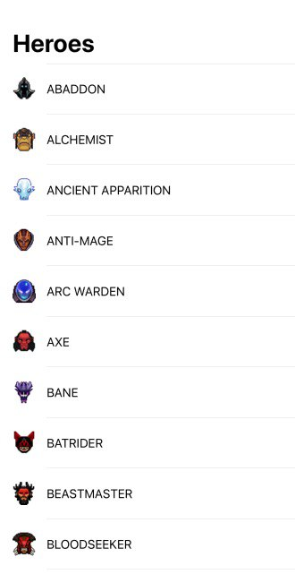
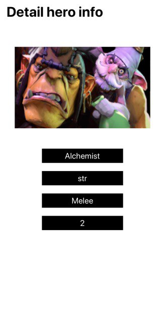

# DotaAPI
This app uses JSON data, decode it and shows the result on two screen.

First screen shows you tableView with all heroes

## Example: ##

Second screen shows you detail information of each hero

## Example: ##

